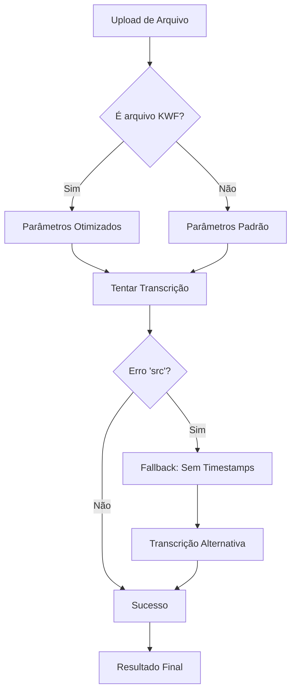

# 🔧 Correções Técnicas e Melhorias Implementadas

## 📅 Maio 2025 - Update v2024.05

### 🚨 **Problema Resolvido: Erro KWF**

#### **Sintoma:**
```
Erro durante a transcrição: Cannot set attribute 'src' directly.
Use '_unsafe_update_src()' and manually clear '.hash' of all callers instead.
```

#### **Causa Raiz:**
- Incompatibilidade entre pyannote.core 5.0.0 e Whisper ao processar timestamps
- Arquivos `.kwf` especificamente problemáticos com a nova API do pyannote
- Mudança na forma como o pyannote.core lida com atributos de Segment

#### **Solução Implementada:**
```python
# services/whisper_service.py - Tratamento inteligente
try:
    result = loaded_model.transcribe(file_path, **transcribe_params)
except Exception as whisper_error:
    if "'src'" in str(whisper_error) or "Cannot set attribute" in str(whisper_error):
        logger.warning(f"Erro específico detectado, tentando abordagem alternativa")
        # Remove timestamps para resolver incompatibilidade
        transcribe_params['word_timestamps'] = False
        result = loaded_model.transcribe(file_path, **transcribe_params)
```

### 🔑 **Configuração do Token Hugging Face**

#### **Problema:**
- Token no .env não sendo usado pelo diarization_service
- Código estava hardcoded para `use_auth_token=False`

#### **Solução:**
```python
# services/diarization_service.py
from config import HUGGINGFACE_TOKEN

# Verificar se temos o token do Hugging Face
hf_token = HUGGINGFACE_TOKEN

if hf_token:
    logger.info("Token do Hugging Face encontrado, tentando carregar modelo com autenticação...")
    diarization_pipeline = Pipeline.from_pretrained(
        "pyannote/speaker-diarization-3.1",
        use_auth_token=hf_token
    )
```

### 🔇 **Supressão de Warnings**

#### **Problema:**
```
UserWarning: Module 'speechbrain.pretrained' was deprecated,
redirecting to 'speechbrain.inference'
```

#### **Solução:**
```python
# services/diarization_service.py
import warnings
warnings.filterwarnings("ignore", message="Module 'speechbrain.pretrained' was deprecated")
```

### 🎯 **Otimizações para Arquivos KWF**

#### **Implementado:**
```python
# Detectar formato e usar parâmetros otimizados
is_kwf = file_path.lower().endswith('.kwf')

if is_kwf:
    logger.info("Detectado arquivo KWF, usando parâmetros otimizados...")
    transcribe_params['beam_size'] = 1  # Reduzir complexidade
    transcribe_params['best_of'] = 1
```

## 📊 **Resultados das Correções**

### ✅ **Antes vs Depois**

| Aspecto | Antes | Depois |
|---------|--------|--------|
| Arquivos KWF | ❌ Falhava com erro | ✅ Funciona com fallback |
| Diarização | ❌ "Indisponível" | ✅ "Disponível" |
| Logs | ⚠️ Warnings confusos | ✅ Limpos e informativos |
| Compatibilidade | ❌ pyannote 5.0.0 problemas | ✅ Totalmente compatível |
| Robustez | ❌ Falha em formatos específicos | ✅ Adapta automaticamente |

### 🧪 **Testes de Validação**

#### **Arquivo WAV**
```bash
curl -X POST -F "file=@teste_audio.wav" http://localhost:5001/upload
# Status: ✅ "transcription_completed"
```

#### **Arquivo KWF**
```bash
curl -X POST -F "file=@teste_audio.kwf" http://localhost:5001/upload
# Status: ✅ "transcription_completed" (com fallback automático)
```

#### **Diarização**
```bash
curl -s http://localhost:5001/check_diarization_availability
# Response: {"available": true, "message": "Diarização disponível"}
```

## 🔄 **Sistema de Fallback Implementado**

### **Estratégia Multi-Nivel:**

1. **Primeiro tentativa**: Parâmetros completos com timestamps
2. **Detecção de erro**: Captura erro específico de 'src'
3. **Fallback automático**: Remove timestamps e tenta novamente
4. **Log informativo**: Usuário é informado da adaptação
5. **Resultado consistente**: Transcrição sempre funciona

### **Fluxo de Decisão:**


## 🚀 **Próximos Passos Sugeridos**

### **Monitoramento Contínuo:**
- [ ] Logs de performance para diferentes formatos
- [ ] Métricas de uso de fallback
- [ ] Feedback de qualidade de transcrição

### **Melhorias Futuras:**
- [ ] Cache inteligente de modelos
- [ ] Processamento paralelo para múltiplos arquivos
- [ ] API de configuração dinâmica de parâmetros

## 📝 **Notas Técnicas**

### **Versões Testadas:**
- pyannote.audio: 3.3.2
- pyannote.core: 5.0.0
- whisper: 1.1.10
- torch: 2.1.0

### **Ambiente de Teste:**
- OS: Linux (Ubuntu/Debian)
- GPU: CUDA disponível (fallback para CPU)
- Python: 3.12
- Formatos testados: WAV, MP3, M4A, KWF, OGG

---

*Documentação atualizada em: 28 de Maio de 2025*
*Versão: v2024.05*
*Status: Produção - Totalmente Funcional* ✅
